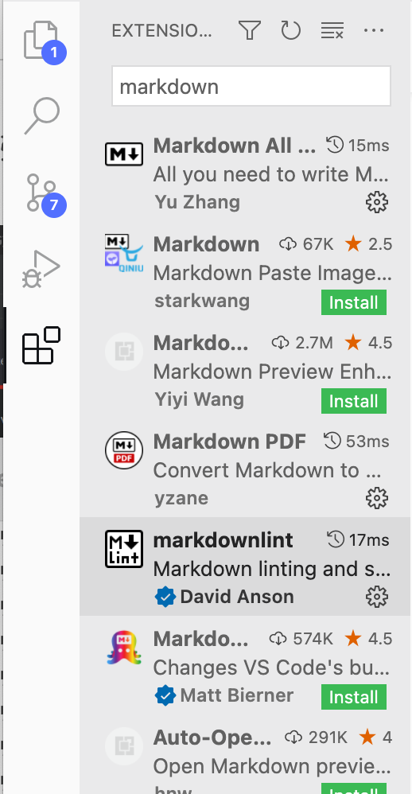

#### 環境

- MacOS 11.5.2
- VSCode 1.64.2

#### 画像表示

``

または

``

今回の場合同じディレクトリに画像と markdown ファイルがある

``
とすると以下のように表示される


画像のサイズを変更したい場合

``

のように width を指定することで変更できる


<br>

Gatsbyのブログmarkdownをブラウザ表示させる時は、このままではサイズが変更されない。

```js
<div style="width: 50%; margin-left: auto; margin-right: auto">


</div>
```

このように表記することでサイズ変更できる

<div style="width: 50%; margin-left: auto; margin-right: auto">


</div>

#### プレビュー表示

1. shift + command + p
2. 検索欄に markdown
3. 検索結果の Markdown: Open Preview to the Side を選択


又は、ショートカットキー command + k, v で表示

#### 拡張機能を入れる

VSCode で markdown を書く時に便利な拡張機能

- Markdown All in One

- markdownlint

拡張機能を入れるには

1. shift + command + p
2. 検索欄に extensions と入力
3. Install Extensions を選択
4. 左の検索欄で markdown と検索
5. 表示されたものの中から Markdown All in One と markdownlint をインストールする


<div style="width: 40%; margin-left: auto; margin-right: auto">



</div>

Markdown All in One を入れると便利なショートカットキー、見出しのナンバリング、リスト・リンクの入力支援などが使えるようになる

例えば、url を command + c でコピーしておき、リンクを貼り付けたいワードを選択し、command + v をすると自動でリンクの形式にしてくれる

markdownlintは構文とスタイルをチェックしてくれる拡張機能

<div style="width: 80%; margin-left: auto; margin-right: auto">


</div>

画像のように波線表示がされるようになります。ここが、Markdownの構文的にまたはスタイル的に修正したほうがよい箇所という具合になる

参考：[VsCode でマークダウンファイル(.md)を快適に使用する Tips](https://maasaablog.com/tools/visual-studio-code/1762/)
