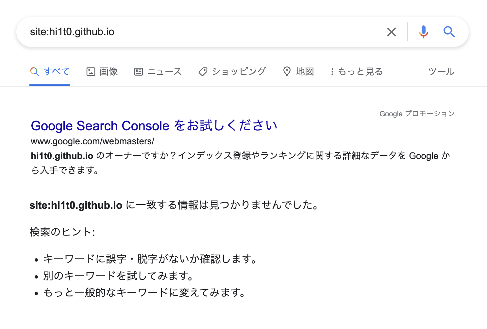
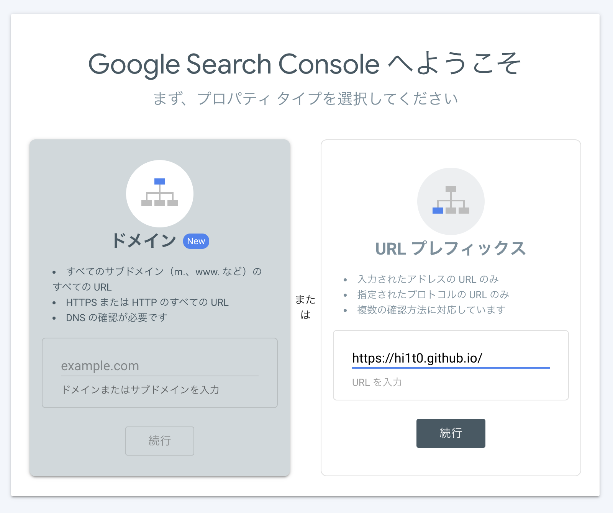
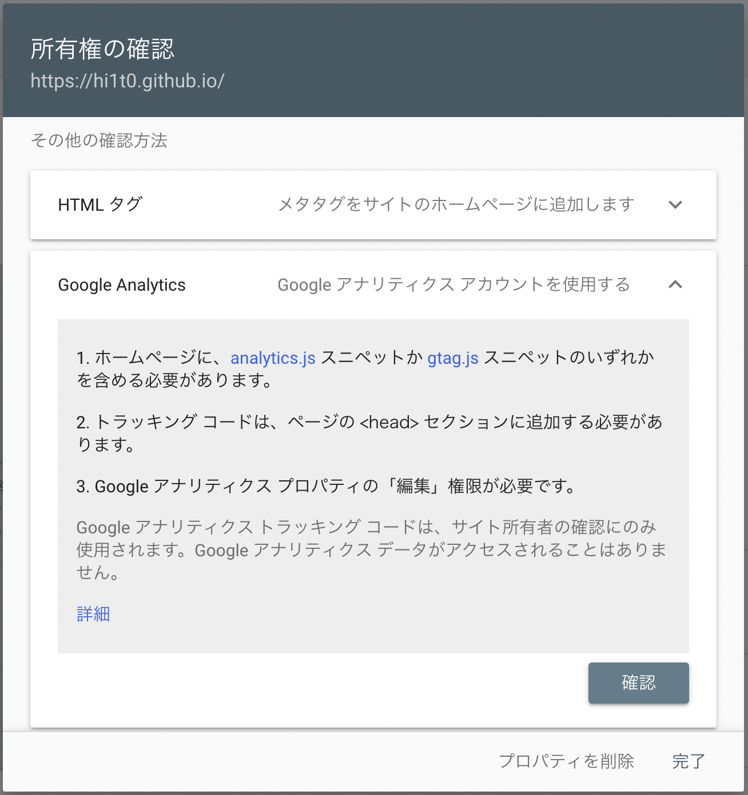
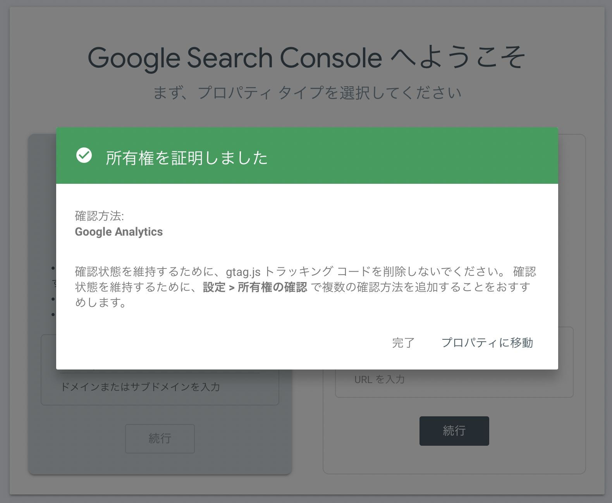

Google検索してもサイトが出てこないので調べてみたら、Google Search Consoleを登録すると検索結果の表示改善につながるということなので登録します
<div style="width: 100%; margin-left: auto; margin-right: auto">



</div>

とその前段階で[Google Analytics](https://analytics.google.com/)に登録しておきます。

アナリティクスの登録はこちらを見るとわかりやすいです

[GoogleアナリティクスのトラッキングID発行・設定方法](https://www.gpol.co.jp/blog/100)

トラッキングIDはGから始まる方のを使う。トラッキングIDを発行できたらgatsby-config.jsで
```js
// {
//   resolve: `gatsby-plugin-google-analytics`,
//   options: {
//     trackingId: `ADD YOUR TRACKING ID HERE`,
//   },
// },
```
~~この部分のコメントアウトを外し、トラッキングIDを入力する~~

どうやらgatsby-plugin-google-analyticsは古いらしく今は`gatsby-plugin-google-gtag`を使う

```js
$ npm i gatsby-plugin-google-gtag
```
でパッケージをインストールし

```js
{
    resolve: `gatsby-plugin-google-gtag`,
        options: {
            trackingIds: [`ADD YOUR TRACKING ID HERE`],
            pluginConfig: {
                head: true,
            },
        },
}
```
gatsby-plugin-google-analyticの部分を上記の項目に書き換える

Google Search ConsoleのサイトでURLプレフィックスの入力欄に`https://hi1t0.github.io/`を入力、続行をクリック

<div style="width: 100%; margin-left: auto; margin-right: auto">



</div>

Google Analyticsの欄を選択、確認クリック

<div style="width: 100%; margin-left: auto; margin-right: auto">



</div>

以下のように確認ができる

<div style="width: 100%; margin-left: auto; margin-right: auto">



</div>