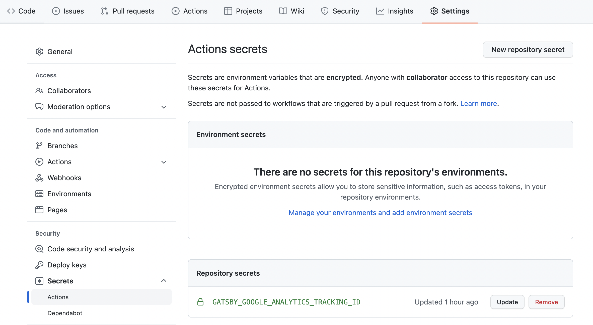

Gatsbyの公式サイトを見ると`gatsby develop`でプロジェクトを立ち上げると変数は.env.development、`gatsby build`の時は.env.productionが適応される
[Environment Variables](https://www.gatsbyjs.com/docs/how-to/local-development/environment-variables/)

gatsby-config.jsで使用する場合、先頭に以下の文を含める
```js
require("dotenv").config({
  path: `.env.${process.env.NODE_ENV}`,
})

module.exports = {
  siteMetadata: {
      ...
```
srcフォルダ以下のjsファイルでは`require("dotenv")`をする必要はない

デフォルトでは、環境変数はNode.jsコードでのみ使用可能であり、ブラウザーでは使用できません。一部の変数は秘密にして、サイトにアクセスする人に公開しないようにする必要があるため

ブラウザで変数を公開するには、その名前の前にGATSBY_を付ける必要があります。 したがって、
```js
GOOGLE_ANALYTICS_TRACKING_ID="G-WVTLJLZHVS"
GATSBY_API_ENDPOINT="https://xxx.com"
```
の場合
GATSBY_API_ENDPOINTはブラウザコードで使用できますが、GOOGLE_ANALYTICS_TRACKING_IDは使用できない

.env.developmentと.env.productionを設定しgit pushしたところ変数が代入されていなかった

調べたところGithub Actionsで変数を扱いたい場合プロジェクトのSettings → Secrets → Actionsを選択
New repository secretをクリックして、変数のペアを入力する

<div style="width: 100%; margin-left: auto; margin-right: auto">



</div>

登録した変数を使用する時は、`${{ secrets.変数 }}`

.github/workflows/gh-pages.ymlを以下のように変更する

```
  - name: Build
    run: npm run build
    env:
      GOOGLE_ANALYTICS_TRACKING_ID: ${{ secrets.GOOGLE_ANALYTICS_TRACKING_ID }}
      NODE_ENV: "production"
```

これで`process.env.GOOGLE_ANALYTICS_TRACKING_ID`で変数の値にアクセスできるようになる

[Using environment variables in Gatsby site deployed on GitHub pages](https://stackoverflow.com/questions/64109619/using-environment-variables-in-gatsby-site-deployed-on-github-pages)

[Gatsby Incremental Builds and Github Actions](https://www.raulmelo.dev/blog/cache-gatsby-github-actions)