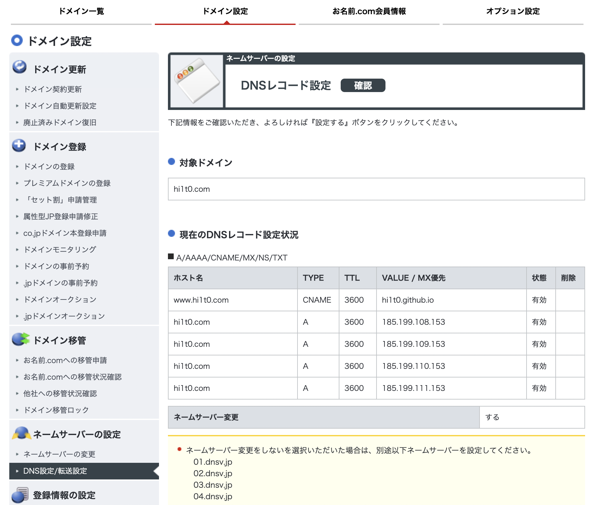
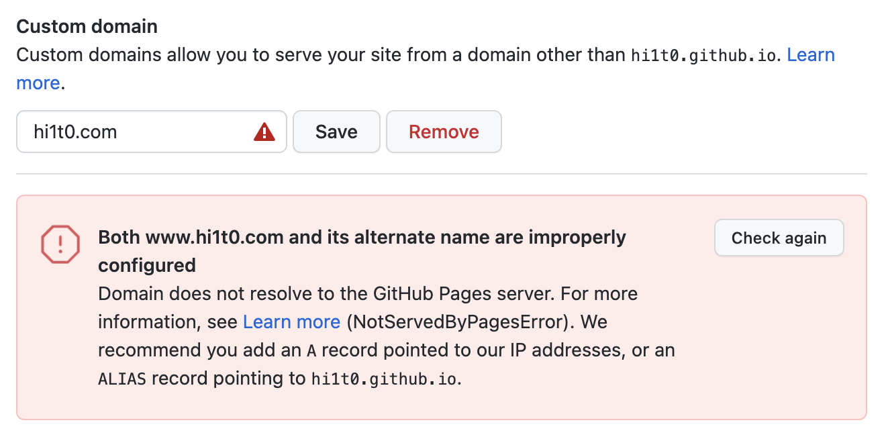
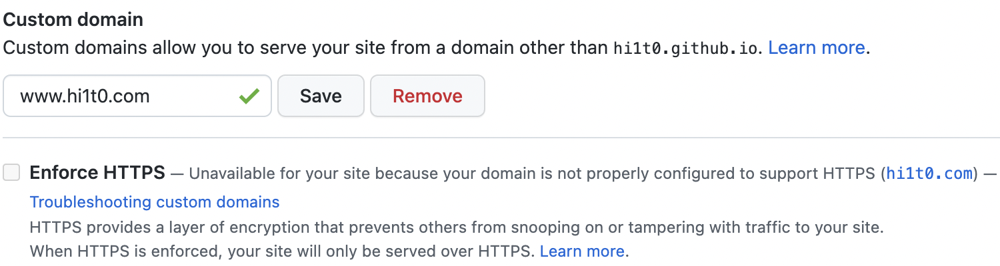
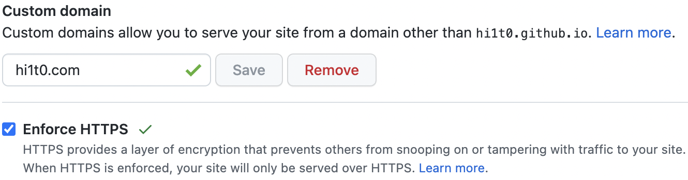

お名前.comでドメインを取得し、

[GitHub Pagesに独自ドメインを設定する方法](https://zenn.dev/donchan922/articles/59c54fe659128294bb65)

こちらを参考にDNSレコードの設定をしました

Github Pagesでカスタムドメインを入力しSaveを押すとエラーになります

時間をおいてから試してみろと書いてあったので後で試す

[How to fix: Domain does not resolve to the GitHub Pages server. Error in Github Pages for custom domain setup with Enforce HTTPS Enabled?](https://stackoverflow.com/questions/54059217/how-to-fix-domain-does-not-resolve-to-the-github-pages-server-error-in-github)

...

...

...
結果

...

...

...

ただのボタンの押し忘れでした

Github Pagesの方も普通に通りました

めでたしめでたし

とここで問題が！

https化できてない...

Enforce HTTPSのチェックボックスが押せない。。。

。。。

。。。

お名前.com　Github Pages　https化でググっても
みんなやり方が同じ。。。

わからん。。

。

と再度Github Pagesでチェックポックスを押せないか試したところ。。。

なんと押せました！

少し時間を置かないといけないみたいですね

めでたしめでたし