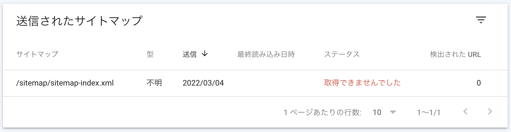
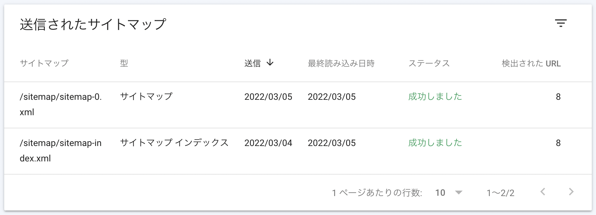

パッケージインストール
```js
$ npm install gatsby-plugin-sitemap
```

gatsby-config.jsのpluginsに以下の項目を追加するだけ
```js
  siteMetadata: {
    siteUrl: `https://hi1t0.com`,
  },
  plugins: [
    `gatsby-plugin-sitemap`
  ]
```

[Google Search Console](https://search.google.com/)を開き

`/sitemap/sitemap-index.xml`を入力しサイトマップを追加する

<div style="width: 100%; margin-left: auto; margin-right: auto">



</div>

後日確認したところステータスは成功になっていました

<div style="width: 100%; margin-left: auto; margin-right: auto">



</div>