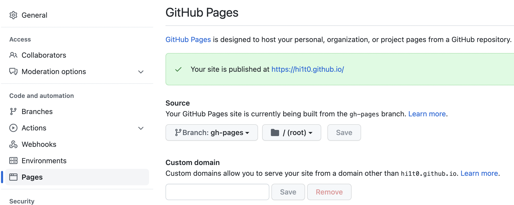
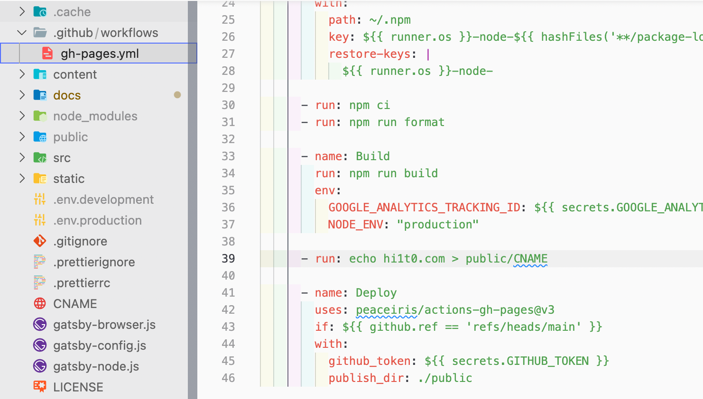

```
$ git push origin main
```
でページを更新するとGithub PagesのCustom domainの欄が空白になってしまう

<div style="width: 100%; margin-left: auto; margin-right: auto">



</div>

調べた結果、

カスタムドメインを入力してSaveを押すとCNAMEというファイルがGithub Pagesに反映されているリポジトリに生成される。これを更新する時に含めなければいけなかった

<div style="width: 100%; margin-left: auto; margin-right: auto">


</div>

CNAMEはカスタムドメイン名だけが書かれたファイル

なので.github/workflow/gh-pages.ymlの中身に１行加える
```
$ - run: echo hi1t0.com > public/CNAME
```

<div style="width: 100%; margin-left: auto; margin-right: auto">



</div>

これでgit pushした時にpublicフォルダにCNAMEファイルが含まれるようになる

参考：[ファイルへ出力する](https://jj-blues.com/cms/wantto-outputtofile/)