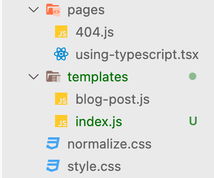

gatsby-starter-blogを使用しています

```js
$ yarn add gatsby-awesome-pagination
```

でプラグインを追加

gatsby-node.jsを編集
```js
const path = require(`path`)
const { createFilePath } = require(`gatsby-source-filesystem`)
const { paginate } = require(`gatsby-awesome-pagination`)

exports.createPages = async ({ graphql, actions, reporter }) => {
  const { createPage } = actions

  // Define a template for blog post
  const blogPost = path.resolve(`./src/templates/blog-post.js`)
  const blogIndex = path.resolve(`./src/templates/index.js`)

  // Get all markdown blog posts sorted by date
  const result = await graphql(
    `
      {
        allMarkdownRemark(
          sort: { fields: [frontmatter___date], order: ASC }
          limit: 1000
        ) {
          nodes {
            id
            fields {
              slug
            }
          }
        }
      }
    `
  )

  if (result.errors) {
    reporter.panicOnBuild(
      `There was an error loading your blog posts`,
      result.errors
    )
    return
  }

  const posts = result.data.allMarkdownRemark.nodes

  // Create blog posts pages
  // But only if there's at least one markdown file found at "content/blog" (defined in gatsby-config.js)
  // `context` is available in the template as a prop and as a variable in GraphQL

  if (posts.length > 0) {
    posts.forEach((post, index) => {
      const previousPostId = index === 0 ? null : posts[index - 1].id
      const nextPostId = index === posts.length - 1 ? null : posts[index + 1].id

      createPage({
        path: post.fields.slug,
        component: blogPost,
        context: {
          id: post.id,
          previousPostId,
          nextPostId,
        },
      })
    })

    // Create your paginated pages
    paginate({
      createPage,
      items: posts,
      itemsPerPage: 3,
      pathPrefix: ({ pageNumber }) => (pageNumber === 0 ? "/" : "/page"),
      component: blogIndex
    })
  }
}
...
```

index.jsをtemplatesフォルダへ移動する

<div style="width: 80%; margin-left: auto; margin-right: auto">



</div>

src/templates/index.jsを編集
```js
import * as React from "react"
import { Link, graphql } from "gatsby"

import Bio from "../components/bio"
import Layout from "../components/layout"
import Seo from "../components/seo"
import Pagination from "../components/pagination"

const BlogIndex = ({ data, location, pageContext }) => {
  const siteTitle = data.site.siteMetadata?.title || `Title`
  const posts = data.allMarkdownRemark.nodes

  if (posts.length === 0) {
    return (
      <Layout location={location} title={siteTitle}>
        <Seo title="All posts" />
        <Bio />
        <p>
          No blog posts found. Add markdown posts to "content/blog" (or the
          directory you specified for the "gatsby-source-filesystem" plugin in
          gatsby-config.js).
        </p>
      </Layout>
    )
  }

  return (
    <Layout location={location} title={siteTitle}>
      <Seo title="hi1t0Blog" />
      <Bio />
      <ol style={{ listStyle: `none` }}>
        {posts.map(post => {
          const title = post.frontmatter.title || post.fields.slug

          return (
            <li key={post.fields.slug}>
              <article
                className="post-list-item"
                itemScope
                itemType="http://schema.org/Article"
              >
                <header>
                  <h2>
                    <Link to={post.fields.slug} itemProp="url">
                      <span itemProp="headline">{title}</span>
                    </Link>
                  </h2>
                  <small>{post.frontmatter.date}</small>
                </header>
                <section>
                  <p
                    dangerouslySetInnerHTML={{
                      __html: post.frontmatter.description || post.excerpt,
                    }}
                    itemProp="description"
                  />
                </section>
              </article>
            </li>
          )
        })}
      </ol>
      <footer>
        <Pagination pageContext={pageContext} />
      </footer>
    </Layout>
  )
}

export default BlogIndex

export const pageQuery = graphql`
  query ($skip: Int!, $limit: Int!) {
    site {
      siteMetadata {
        title
      }
    }
    allMarkdownRemark(
      sort: { fields: [frontmatter___date], order: DESC }
      skip: $skip
      limit: $limit
    ) {
      nodes {
        excerpt
        fields {
          slug
        }
        frontmatter {
          date(formatString: "MMMM DD, YYYY")
          title
          description
        }
      }
    }
  }
`
```

componentフォルダにpagination.jsを追加
Material-uiを使うためあらかじめパッケージをインストール
```
$ yarn add gatsby-plugin-material-ui @material-ui/core @material-ui/lab
```

gatsby-config.jsに追加
```js
module.exports = {
  siteMetadata: {
    title: `hi1t0 Blog`,
    ...
  },
  plugins: [
    `gatsby-plugin-material-ui`,
    ...
```

src/component/pagination.js
```js
import React from "react"
import { navigate } from "gatsby"
import { makeStyles } from "@material-ui/core"
import * as muiLab from "@material-ui/lab"

const useStyles = makeStyles({
    root: {
        display: `flex`,
        flexWrap: `wrap`,
        justifyContent: `center`,
        alignItems: "center",
    },
});

const Pagination = ({ pageContext }) => {
    const classes = useStyles()
    const { numberOfPages, humanPageNumber } = pageContext

    const handleChange = (_event, value) => {
        value === 1 ? navigate(`/`) : navigate(`/page/${value}`)
    }
    return (
        <div className={classes.root}>
            <muiLab.Pagination
                variant="outlined"
                defaultPage={humanPageNumber}
                count={numberOfPages}
                onChange={handleChange}
                // size="small"
                color="primary"
                shape="rounded"
            />
        </div>
    )
}
export default Pagination
```

これで以下のようにページネーションを使うことができる

<div style="width: 100%; margin-left: auto; margin-right: auto">


</div>

参考：[Gatsbyブログにページネーションを導入する](https://blog.jack-s.com/gatsby-pagination/)

