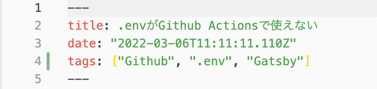
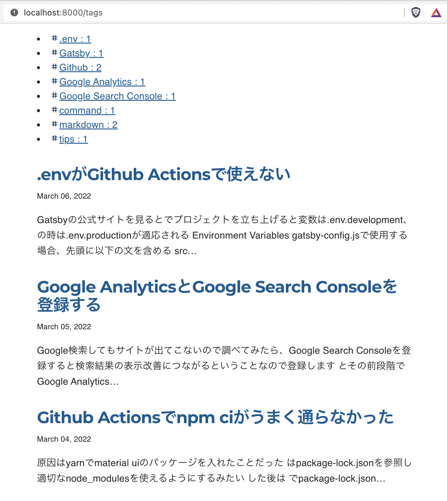
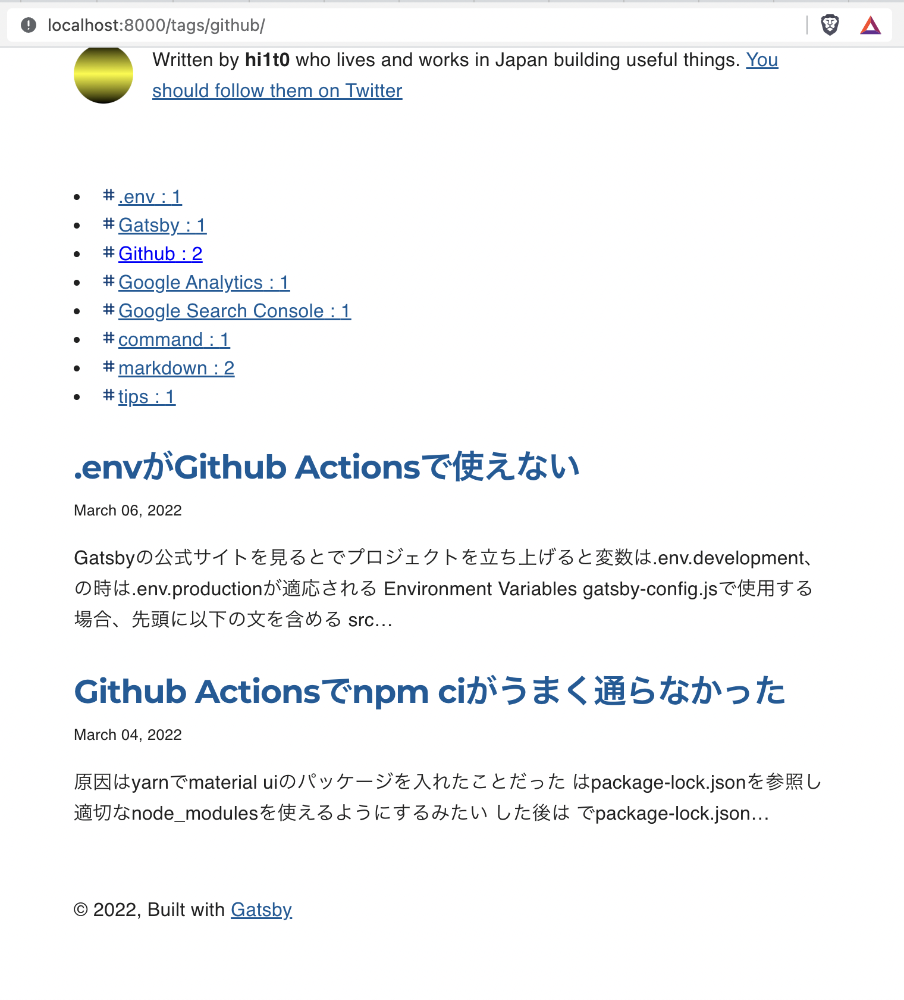

編集する箇所は、gatsby-node.js、投稿するmarkdown

<div style="width: 100%; margin-left: auto; margin-right: auto">



</div>

新たにsrc/templates/tags-and-blog-list.js、
src/components/tags.jsを生成

gatsby-node.jsを見ていきます
```js
const path = require(`path`)
const _ = require(`lodash`)
const { createFilePath } = require(`gatsby-source-filesystem`)
const { paginate } = require(`gatsby-awesome-pagination`)

exports.createPages = async ({ graphql, actions, reporter }) => {
  const { createPage } = actions

  // Define a template for blog post
  const blogPost = path.resolve(`./src/templates/blog-post.js`)
  const blogList = path.resolve(`./src/templates/blog-list.js`)
  const tagsAndBlogList = path.resolve("src/templates/tags-and-blog-list.js")

  // Get all markdown blog posts sorted by date
  const result = await graphql(
    `
      {
        posts: allMarkdownRemark(
          sort: { fields: [frontmatter___date], order: ASC }
          limit: 1000
        ) {
          nodes {
            id
            fields {
              slug
            }
          }
        }
        tags: allMarkdownRemark(limit: 2000) {
          group(field: frontmatter___tags) {
            fieldValue
          }
        }
      }
    `
  )

  if (result.errors) {
    reporter.panicOnBuild(
      `There was an error loading your blog posts`,
      result.errors
    )
    return
  }

  const posts = result.data.posts.nodes
  const tags = result.data.tags.group

  // Create blog posts pages
  // But only if there's at least one markdown file found at "content/blog" (defined in gatsby-config.js)
  // `context` is available in the template as a prop and as a variable in GraphQL

  if (posts.length > 0) {
    posts.forEach((post, index) => {
      const previousPostId = index === 0 ? null : posts[index - 1].id
      const nextPostId = index === posts.length - 1 ? null : posts[index + 1].id

      createPage({
        path: post.fields.slug,
        component: blogPost,
        context: {
          id: post.id,
          previousPostId,
          nextPostId,
        },
      })
    })

    // Create your paginated pages
    paginate({
      createPage,
      items: posts,
      itemsPerPage: 6,
      pathPrefix: ({ pageNumber }) => (pageNumber === 0 ? "/page" : "/page"),
      component: blogList,
      // context: {
      //   tags: tags,
      // },
    })

  }

  /* tag */
  createPage({
    path: '/tags',
    component: tagsAndBlogList,
    context: { tag: "*" }
  });

  /* 同じtagのリストページ */
  if (tags.length > 0) {
    tags.forEach(tag => {
      createPage({
        path: `/tags/${_.kebabCase(tag.fieldValue)}/`,
        component: tagsAndBlogList,
        context: {
          tag: tag.fieldValue,
        },
      })
    })
  }
}
```

表示するページはタグを全種類と選択しているタグに紐ずく投稿
graphqlで全種類のタグを取得

```js
createPage({
    path: '/tags',
    component: tagsAndBlogList,
    context: { tag: "*" }
  });
```

`/tags`ページはタグがついている投稿は全部表示される

```js
context: { tag: "*" }
```

ここで全てのタグが対象になる

```js
if (tags.length > 0) {
    tags.forEach(tag => {
      createPage({
        path: `/tags/${_.kebabCase(tag.fieldValue)}/`,
        component: tagsAndBlogList,
        context: {
          tag: tag.fieldValue,
        },
      })
    })
  }
```

こちら`/tags/${_.kebabCase(tag.fieldValue)}/`ページは一つのタグに紐付いた投稿が表示される

src/templates/tags-and-blog-list.js
```js
import * as React from "react"
import { graphql } from "gatsby"

import Bio from "../components/bio"
import Layout from "../components/layout"
import Seo from "../components/seo"
import Tags from "../components/tags"
import Blogs from "../components/blogs"

const TagsAndBlogListTemplate = ({ data, location, pageContext }) => {
  const siteTitle = data.site.siteMetadata?.title || `Title`

  const posts = data.selectedTag.nodes
  const tags = data.allTag.group

  const uniquePosts = Array.from(
    new Map(posts.map((post) => [post.fields.slug, post])).values()
  );

  return (
    <Layout location={location} title={siteTitle}>
      <Seo title="TagList" />
      <Bio />
      <Tags tags={tags} selectedTag={pageContext.tag}/>
      <Blogs posts={uniquePosts} />
    </Layout>
  )
}

export default TagsAndBlogListTemplate

export const pageQuery = graphql`
  query ($tag: String) {
    site {
      siteMetadata {
        title
      }
    }
    selectedTag: allMarkdownRemark(
      sort: { fields: [frontmatter___date], order: DESC }
      filter: {
        frontmatter: {
          tags: { glob: $tag }
        }
      }
    ) {
      group(field: frontmatter___tags) {
        fieldValue
        totalCount
      }
      nodes {
        excerpt
        fields {
          slug
        }
        frontmatter {
          date(formatString: "MMMM DD, YYYY")
          title
          description
        }
      }
    }
    allTag: allMarkdownRemark(limit: 2000) {
      group(field: frontmatter___tags) {
        fieldValue
        totalCount
      }
    }
  }
`
```

ここでのポイントは

タグでフィルターしているため複数のタグがある記事をタグの数だけ取得してしまうから重複を排除

```js
  const uniquePosts = Array.from(
    new Map(posts.map((post) => [post.fields.slug, post])).values()
  );
```

TagsコンポーネントとBlogsコンポーネントは以下のようになる

```js
import * as React from "react"
import { Link } from "gatsby"
import _ from "lodash"
import TagIcon from '@mui/icons-material/Tag';
import { makeStyles } from "@mui/styles"

const useStyles = makeStyles({
  tags: {
  },
  selectedTag: {
    color: `blue`,
  }
});

const Tags = ({ tags, selectedTag }) => {
  const classes = useStyles()
  return (
    <div className={classes.tags}>
      {tags.map( tag => (
        <li key={tag.fieldValue}>
          <TagIcon style={{ "paddingTop": "2px", "fontSize": "1.0em", color: "#09427B" }}/>
          <Link to={`/tags/${_.kebabCase(tag.fieldValue)}/`} className={selectedTag === tag.fieldValue ? classes.selectedTag : '' }>
            {tag.fieldValue}
            <span> : {tag.totalCount}</span>
          </Link>
        </li>
      ))}
    </div>
  )
}


export default Tags
```

```js
import * as React from "react"
import { Link } from "gatsby"


const Blogs = ({ posts }) => {

  return (
    <ol style={{ listStyle: `none` }}>
      {posts.map(post => {
        const title = post.frontmatter.title || post.fields.slug

        return (
          <li key={post.fields.slug}>
            <article
            className="post-list-item"
            itemScope
            itemType="http://schema.org/Article"
            >
            <header>
                <h2>
                <Link to={post.fields.slug} itemProp="url">
                    <span itemProp="headline">{title}</span>
                </Link>
                </h2>
                <small>{post.frontmatter.date}</small>
            </header>
            <section>
                <p
                dangerouslySetInnerHTML={{
                    __html: post.frontmatter.description || post.excerpt,
                }}
                itemProp="description"
                />
            </section>
            </article>
          </li>
        )
      })}
    </ol>
  )
}

export default Blogs
```

表示結果はそれぞれ以下のようになります。見た目が悪いので次回整えていきます

<div style="width: 100%; margin-left: auto; margin-right: auto">



</div>

<div style="width: 100%; margin-left: auto; margin-right: auto">



</div>

参考：

・[Gatsbyにタグ機能、カテゴリ機能をつける（基礎編）](https://qiita.com/yoshiki-0428/items/71d80713ffc264cf40f1)

・[タグ機能、カテゴリ機能をつける（応用編）](https://tech-blog.yoshikiohashi.dev/posts/start-gatsby-blog-add-tags-application)