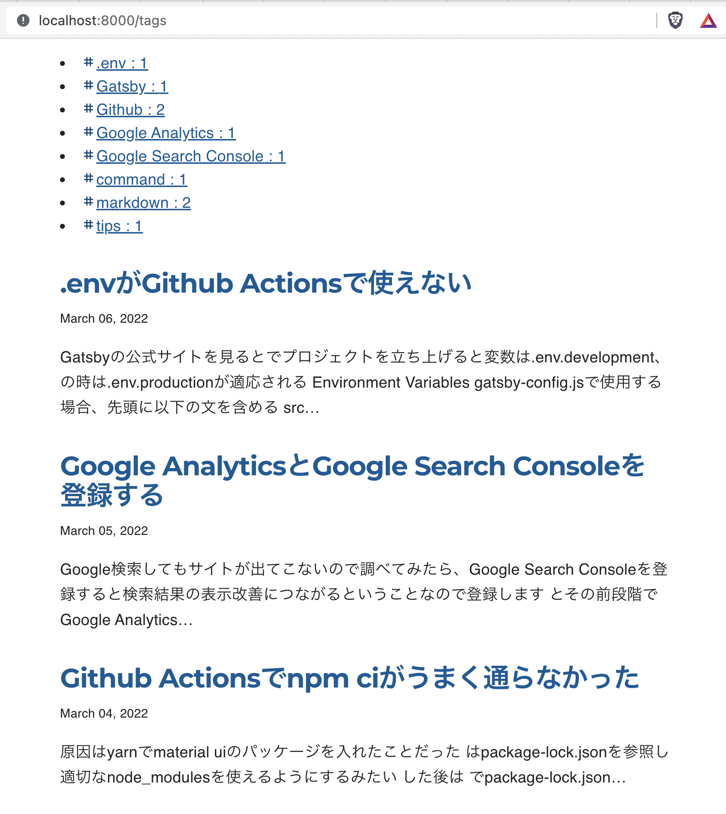
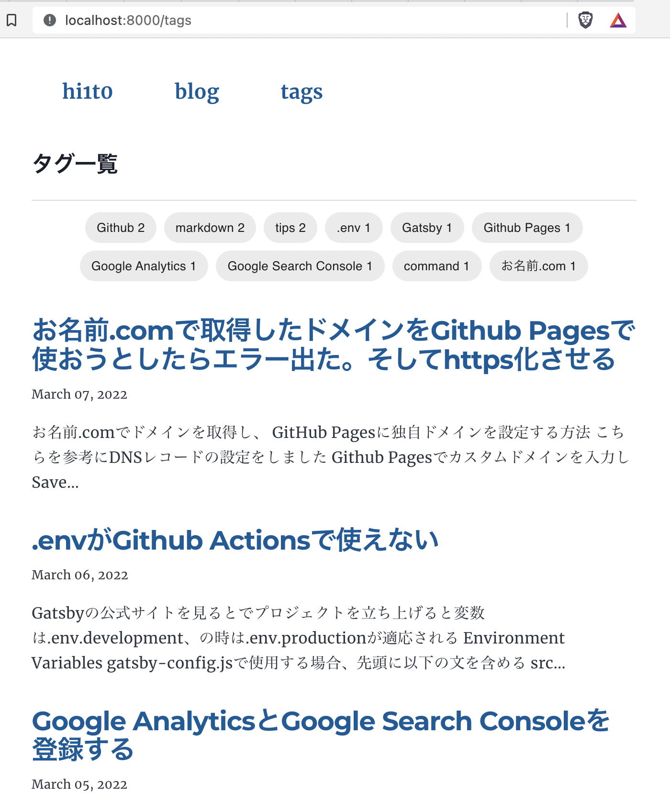
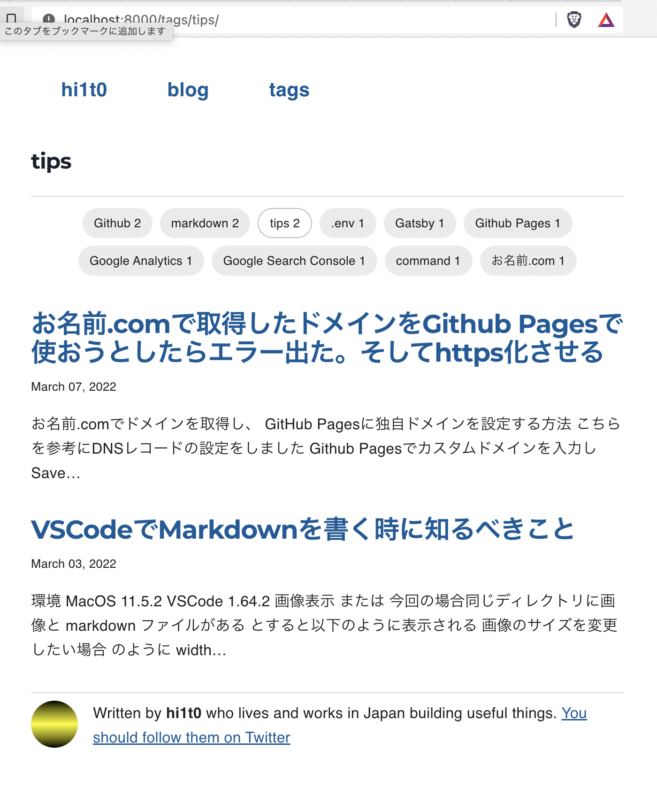

編集前の見た目は

<div style="width: 100%; margin-left: auto; margin-right: auto">



</div>

ソースコードはsrc/component/tags.js
```js
import * as React from "react"
import { Link } from "gatsby"
import _ from "lodash"
import TagIcon from '@mui/icons-material/Tag';
import { makeStyles } from "@mui/styles"

const useStyles = makeStyles({
  tags: {
  },
  selectedTag: {
    color: `blue`,
  }
});

const Tags = ({ tags, selectedTag }) => {
  const classes = useStyles()
  return (
    <div className={classes.tags}>
      {tags.map( tag => (
        <li key={tag.fieldValue}>
          <TagIcon style={{ "paddingTop": "2px", "fontSize": "1.0em", color: "#09427B" }}/>
          <Link to={`/tags/${_.kebabCase(tag.fieldValue)}/`} className={selectedTag === tag.fieldValue ? classes.selectedTag : '' }>
            {tag.fieldValue}
            <span> : {tag.totalCount}</span>
          </Link>
        </li>
      ))}
    </div>
  )
}


export default Tags
```

主な変更点は、tags.mapの中の`<li>`の部分をmaterial-uiの`<Chip>`コンポーネントに変えた

細部の調整はmaterial-uiのmakeStylesを使用

```js
/* タグリスト */
import * as React from "react"
import _ from "lodash"
import { makeStyles } from "@mui/styles"
import { Chip } from "@mui/material"
// import TagIcon from '@mui/icons-material/Tag';

const useStyles = makeStyles({
  tagsContainer: {
    display: `flex`,
    flexWrap: `wrap`,
    justifyContent: `center`,
    alignItems: `center`,
  },
  tag: {
    margin: `4px`,
  },
  tagIcon: {
    paddingTop: `5px`,
    paddingBottom: `5px`,
  },
  tagsTotalCount: {
    marginLeft: `10px`,
  },
});

const sortTotalCount = (tags) => _.orderBy(tags, ['totalCount', 'fieldValue'], ['desc']);

const Tags = ({ tags, selectedTag }) => {
  const classes = useStyles()
  return (
    <div className={classes.tagsContainer}>
      {sortTotalCount(tags).map(tag => (
      // {tags.map( tag => (
        <div key={tag.fieldValue} className={classes.tag}>
          <Chip
            label={`${tag.fieldValue} ${tag.totalCount}`}
            component="a"
            href={`/tags/${_.kebabCase(tag.fieldValue)}/`}
            variant={selectedTag === tag.fieldValue ? `outlined` : ''}
            clickable
            // icon={<TagIcon className={classes.tagIcon} />}
          />
        </div>
      ))}
    </div>
  )
}


export default Tags
```

変更後は見やすくすっきりしました

<div style="width: 100%; margin-left: auto; margin-right: auto">



</div>

<div style="width: 100%; margin-left: auto; margin-right: auto">



</div>
